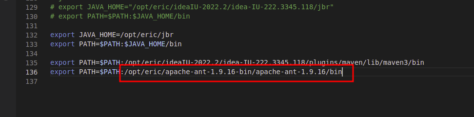
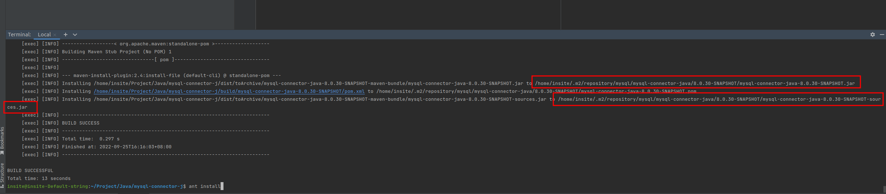

开发文档
===

推荐使用eclipse开发。

https://www.eclipse.org/downloads/download.php

https://blog.csdn.net/anxinlong/article/details/109190867

下载安装ant

https://ant.apache.org/

配置环境变量



打包并且安装jar和source文件

```shell
 ant install
```




https://dev.mysql.com/doc/connectors/en/connector-j-installing-source.html


https://blog.csdn.net/phenixyf/article/details/52515598